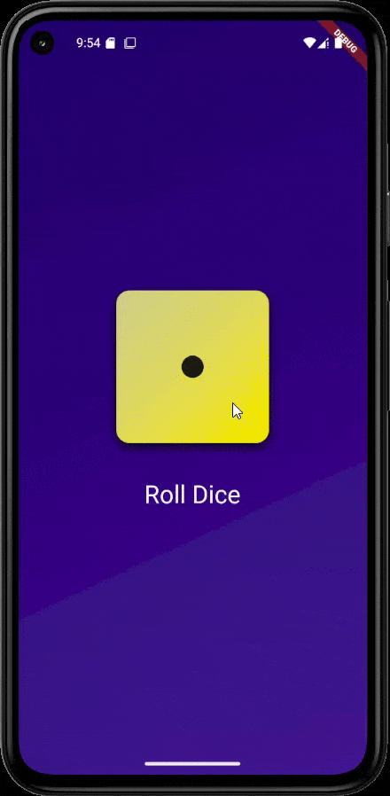

# Roll Dice App

## Overview

The Roll Dice App is a simple yet engaging application that allows users to simulate rolling a dice. Each press of the roll button generates a random number between 1 and 6, mimicking the experience of rolling a physical dice. This app is developed using Flutter, a powerful UI toolkit that enables the creation of natively compiled applications for mobile, web, and desktop from a single codebase. The programming language used is Dart, known for its efficiency in building fast, multi-platform applications.

## Table of Contents

- [Overview](#overview)
- [Features](#features)
- [Preview](#preview)
- [Prerequisites](#prerequisites)
- [How to Run](#how-to-run)
- [Built With](#built-with)
- [License](#license)

## Built With

| Technology       | Badge                                                                 |
|------------------|-----------------------------------------------------------------------|
| Flutter          |  |
| Dart             |  |
| Android Studio   |  |

## Features

- Simulates a dice roll with a random number between 1 and 6.
- Simple and intuitive user interface.

## Preview

Check out the preview of the Roll Dice App:



## Prerequisites

- **Flutter SDK**: Make sure you have Flutter installed and set up on your machine. For more information on how to install Flutter, visit the [official Flutter installation guide](https://docs.flutter.dev/get-started/install).
- **Dart SDK**: The Dart SDK is bundled with Flutter; no separate installation is required.
- **Code Editor**: A code editor such as Visual Studio Code or Android Studio. Both provide excellent support for Flutter and Dart development.
- **Android Studio**: Recommended for Android development. It includes the Android SDK, which is necessary for building and running Flutter apps on Android devices.

## How to Run

1. **Clone the repository:**
  ```sh
  git clone https://github.com/yourusername/roll-dice-app.git
  cd roll-dice-app
  ```

2. **Install dependencies:**
  ```sh
  flutter pub get
  ```

3. **Run the app:**
  ```sh
  flutter run
  ```

## License

This project is licensed under the MIT License - see the [LICENSE](LICENSE) file for details.